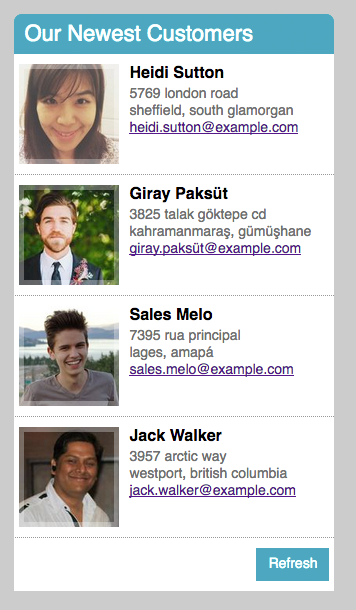

## Welcome to Haven Life's `Our Newest Customers` module!

Made by Kevin Ho, for the candidacy of the _Front End Web Developer_ role at **Haven Life** on 06/19/2018.

* Remember to `npm install` after cloning the repo.
* Start the app up in development mode (with webpack) using `npm run start-dev` and go to [localhost on PORT 1337](http://localhost:1337/).
* Alternatively, `npm run start` fires up ONLY `node index.js` without webpack (assuming a pre-existing `bundle.js` file, useful for production mode).

_Thank you for your time in reviewing my project._

## Project Specs from Todd Rodgers, CTO of Haven Life

Below is a simple design for a module that we'd like you to recreate using HTML/CSS/JS. Feel free to use React (or even Angular!) if you prefer.

1. All of the data for the "Customers" here, both on initial load and whenever a user clicks the Refresh button, should be populated using the [Random User API](https://randomuser.me/). Their website has simple examples and usage instructions; it's just an Ajax call that returns a JSON object populated with dummy user info.
2. This is currently the mobile design, you can responsively adjust the layout to make it look nice on larger screens, but whatever "nice" means is up to you.
3. Don't spend time worrying about exact fonts, line-heights, etc. but the general look and feel should be in line with the above.
4. Please use a promise or promise-based library to interact with the API. An example of this is Axios, but you can also check out Q or Bluebird. Make sure that there are corresponding error states reflected on the front end as well.

